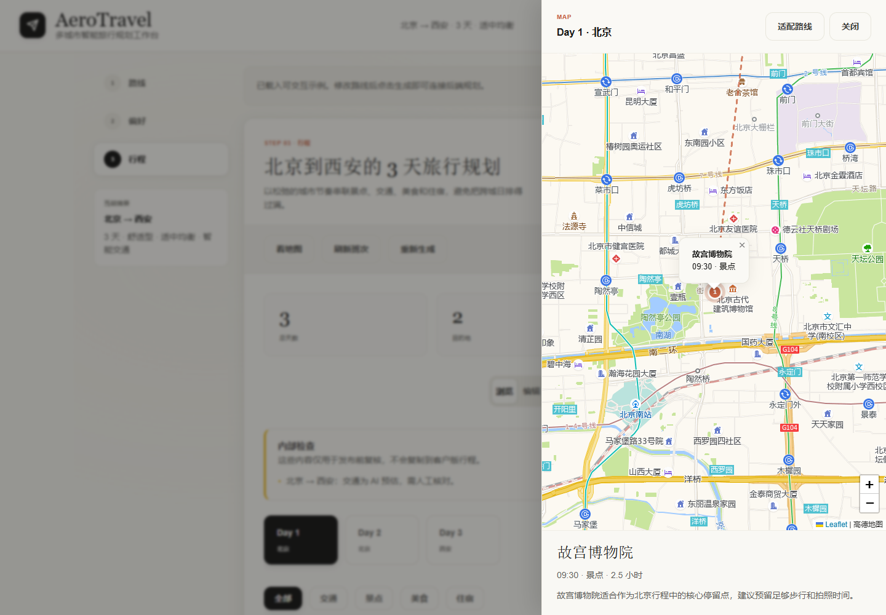
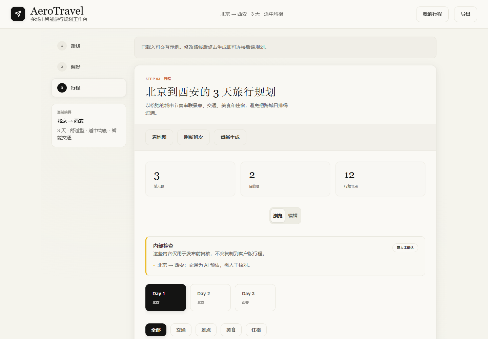
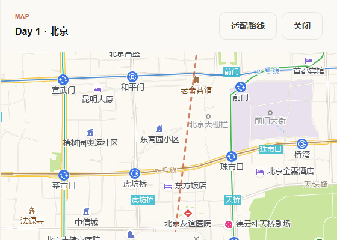
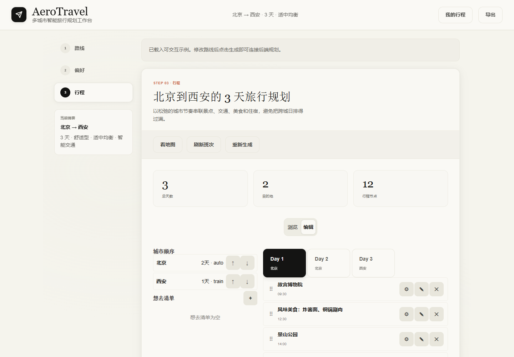
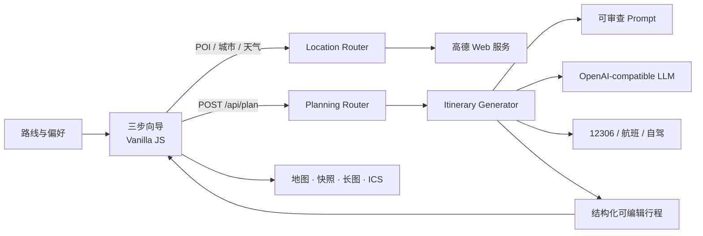

<h1 align="center">AeroTravel</h1>

<p align="center">
  <strong>中国多城市 AI 旅行规划师</strong><br>
  把路线灵感变成一份能执行、能调整、能带走的完整行程。
</p>

<p align="center">
  
  
  
  
  
</p>

<p align="center">
  <a href="#60-秒本地启动">快速开始</a> ·
  <a href="#不止生成文本">产品界面</a> ·
  <a href="#系统如何工作">系统架构</a> ·
  <a href="#当前-github-分支">分支说明</a>
</p>



路线、天气、景点、交通和预算，最后落到同一份可编辑行程里。AeroTravel 面向中国多城市旅行，把高德 POI、天气、12306 火车、航班参考数据和按需地图串成结构化结果，而不只是生成一段“看起来合理”的文本。

| 多城规划 | 真实数据 | 自由调整 | 直接交付 |
|---|---|---|---|
| 每城天数与段级交通 | 高德 POI、天气、12306 | 编辑、约束与自驾重算 | 长图、日历与本地快照 |

## 从想法到出发，只需要三步

| 01 路线 | 02 偏好 | 03 行程 |
|---|---|---|
| 设置城市顺序、停留天数、日期和城际交通。 | 告诉它节奏、预算、兴趣和需要避开的安排。 | 检查地图、编辑节点，保存并导出给同行者。 |

前端采用可滚动三步向导。桌面侧保留行程摘要，地图默认不占主视觉，只有在点击“看地图”或景点卡片时才打开抽屉。

## 不止生成文本



生成结果包含天数、目的地、内部检查、每日安排、城际交通、预算和出行贴士。浏览模式适合快速评审，编辑模式负责城市顺序、想去清单、日期节点和硬约束。

<table>
  <tr>
    <td width="50%">
      <br>
      <sub>路线、真实地点与地图上下文</sub>
    </td>
    <td width="50%">
      <br>
      <sub>城市顺序、日期节点、约束与编辑操作</sub>
    </td>
  </tr>
</table>

## 为什么行程更可信

| 能力 | AeroTravel 的处理方式 |
|---|---|
| 地点与天气 | 后端代理高德 Web 服务，获取 POI 坐标、评分、地址、开放时间和城市天气。 |
| AI 编排 | Prompt 独立存放并可审查，支持 OpenAI-compatible Chat Completions，模型供应商可替换。 |
| 城际交通 | 服务端稳定生成 `A → B` 分段，再用 12306 与航班参考数据增强，避免方向和段数漂移。 |
| 编辑与自驾 | 行程可转为草稿，支持必去、固定日期、固定时段、固定顺序以及自驾道路重算。 |
| 数据边界 | 快照只保存在浏览器 `localStorage`；当前无数据库、无账号、无云端同步。 |

## 60 秒本地启动

### 1. 安装依赖

```powershell
pip install -r requirements.txt
```

### 2. 配置环境变量

```powershell
Copy-Item .env.example .env
```

编辑 `.env`：

```dotenv
AMAP_KEY=你的高德 Web 服务 Key
AI_API_KEY=你的模型供应商 Key
AI_BASE_URL=https://api.openai.com/v1
AI_MODEL=gpt-5.5
```

### 3. 启动

**推荐（Windows）：** 双击仓库根目录的 [`start.bat`](start.bat)。  
会自动选用项目 `.conda` 或系统 Python、按需启动后端，并打开 [http://localhost:8000](http://localhost:8000)。服务已在跑时只会打开浏览器。

手动启动：

```powershell
python server.py
```

打开 [http://localhost:8000](http://localhost:8000)。没有真实 API 时，前端仍会载入可交互的示例行程；真实 POI、天气与 AI 生成需要相应 Key。

> **排障：** 若生成时提示「无法连接后端」或浏览器 `Failed to fetch`，请确认服务已启动，并用 **http://localhost:8000** 打开页面。不要直接双击 `static/index.html`（`file://` 会因 CORS 无法调用 API）。
> 关闭后端控制台窗口即可停止服务。
## 模型配置

项目使用 OpenAI-compatible `chat/completions` 接口。模型名称和 endpoint 更新较快，下表按 2026-07-09 的官方文档整理，实际可用性以账号权限为准。

| 供应商 | `AI_BASE_URL` | 推荐 `AI_MODEL` | 适合场景 |
|---|---|---|---|
| OpenAI | `https://api.openai.com/v1` | `gpt-5.5` | 质量优先，复杂多城行程规划。 |
| OpenAI | `https://api.openai.com/v1` | `gpt-5.4-mini` | 成本和速度优先的日常规划。 |
| 阿里云百炼 / 通义千问 | `https://dashscope.aliyuncs.com/compatible-mode/v1` | `qwen3.7-plus` | 中文效果、成本和速度均衡。 |
| 阿里云百炼 / 通义千问 | `https://dashscope.aliyuncs.com/compatible-mode/v1` | `qwen3.7-max` | 更高质量中文规划。 |
| DeepSeek | `https://api.deepseek.com/v1` | `deepseek-v4-flash` | 成本优先，生成速度快。 |
| DeepSeek | `https://api.deepseek.com/v1` | `deepseek-v4-pro` | 推理质量优先。 |

参考：[OpenAI 模型迁移指南](https://developers.openai.com/api/docs/guides/latest-model) · [阿里云百炼模型列表](https://www.alibabacloud.com/help/en/model-studio/models) · [DeepSeek API 说明](https://api-docs.deepseek.com/quick_start/pricing)

DeepSeek 官方已标注 `deepseek-chat` 与 `deepseek-reasoner` 将于 2026-07-24 弃用，旧配置应迁移到 `deepseek-v4-flash` 或 `deepseek-v4-pro`。

## 系统如何工作



| 层 | 技术与边界 |
|---|---|
| 后端 | Python 3.10+、FastAPI、httpx、python-dotenv |
| 前端 | HTML、CSS、Vanilla JavaScript，无构建步骤 |
| 地图与地点 | Leaflet + 高德地图瓦片；高德 Web API 由后端代理 |
| AI | OpenAI-compatible Chat Completions，Prompt 模板外置 |
| 交通 | 12306 公开接口、可选聚合数据航班 API、高德自驾道路参考 |
| 持久化 | 浏览器 `localStorage`，无数据库、无登录系统 |
| 工程治理 | Ruff、Mypy、Coverage、Node `node:test`、detect-secrets、pip-audit、GitHub Actions |

<details>
<summary><strong>核心目录</strong></summary>

```text
ai-travel-planner/
├── server.py              # FastAPI 应用装配入口
├── clients/               # 高德、AI 等外部服务客户端
├── core/                  # 配置、安全默认值、结构化日志
├── planner/               # 生成、Prompt、Hydration、交通与草稿优化
├── prompts/               # 可审查的行程 Prompt 模板
├── routers/               # FastAPI API 路由
├── schemas/               # Pydantic 请求模型
├── services/              # 12306、航班、自驾道路服务
├── static/                # 三步向导、地图、编辑器、快照和导出
├── tests/                 # 后端镜像测试 + 前端 Node 单测
├── docs/                  # 部署、ADR、工程流程和设计规格
├── scripts/               # 本地质量与安全门禁
└── tasks/                 # 产品化规格和 backlog
```

</details>

<details>
<summary><strong>开发与检查命令</strong></summary>

```powershell
# 可选：安装开发质量与安全工具
pip install -r requirements-dev.txt

# 热重载
python -m uvicorn server:app --reload --host 0.0.0.0 --port 8000

# 完整本地质量门禁
.\scripts\check.ps1

# 密钥与依赖安全门禁
.\scripts\security.ps1

# API 冒烟
curl http://localhost:8000/api/health
curl "http://localhost:8000/api/city_center?city=北京"
curl "http://localhost:8000/api/search_pois?city=北京&keywords=景点&count=5"
curl "http://localhost:8000/api/weather?city=北京"
```

</details>

## 生产配置

| 变量 | 默认值 | 说明 |
|---|---|---|
| `APP_ENV` | `development` | 生产设置为 `production`，启用 HSTS 并禁止 `ALLOWED_ORIGINS=*`。 |
| `ALLOWED_ORIGINS` | 本机开发地址 | 逗号分隔的浏览器来源白名单，生产必须配置真实域名。 |
| `EXPOSE_CLIENT_CONFIG` | `false` | 当前前端不需要浏览器端高德 Key，生产保持关闭。 |
| `LOG_LEVEL` | `INFO` | 后端结构化请求日志等级。 |
| `JUHE_FLIGHT_API_KEY` | 空 | 可选；未配置时使用内置航线参考数据。 |

生产环境不要提交 `.env`，不要使用 wildcard CORS，也不要在没有兼容需求时开启 `EXPOSE_CLIENT_CONFIG`。

## 当前 GitHub 分支

GitHub 的 Branches 页面没有自定义备注字段；分支用途在这里和对应 Pull Request 中共同维护。

| 分支 | 用途 | 维护方 | 生命周期 |
|---|---|---|---|
| `master` | 受保护的稳定主分支 | 仓库维护者 | 永久保留，只能通过 PR 合并 |
| `dependabot/github_actions/github-actions-6ebb6fc752` | [PR #13](https://github.com/suiyi117/ai-travel-planner/pull/13) 的 GitHub Actions 分组升级 | Dependabot | PR 合并或关闭后删除 |
| `dependabot/pip/python-dependencies-315ee4c38f` | [PR #14](https://github.com/suiyi117/ai-travel-planner/pull/14) 的 Python 依赖分组升级 | Dependabot | PR 合并或关闭后删除 |

Dependabot 分支名由 GitHub 自动生成，实时状态以对应 PR 为准。完整规则见 [分支管理](docs/engineering/branch-management.md)。

## 工程与上线文档

| 主题 | 文档 |
|---|---|
| 部署、观察与回滚 | [部署清单](docs/deployment-checklist.md) |
| 浏览器和 API 验收 | [人工冒烟清单](docs/smoke-checklist.md) |
| 工程变更与文档触发条件 | [变更管理](docs/engineering/change-management.md) |
| 分支用途、命名与清理 | [分支管理](docs/engineering/branch-management.md) |
| 版本、发布与回滚流程 | [发布流程](docs/engineering/release-process.md) |
| 本地快照与 Auth 边界 | [ADR-001](docs/decisions/ADR-001-local-only-persistence.md) |
| 可编辑行程与约束模型 | [ADR-002](docs/decisions/ADR-002-constraint-driven-editable-planning.md) |
| 产品化任务 | [Backlog](tasks/todo.md) |
| 版本历史 | [CHANGELOG](CHANGELOG.md) |

## License

MIT
