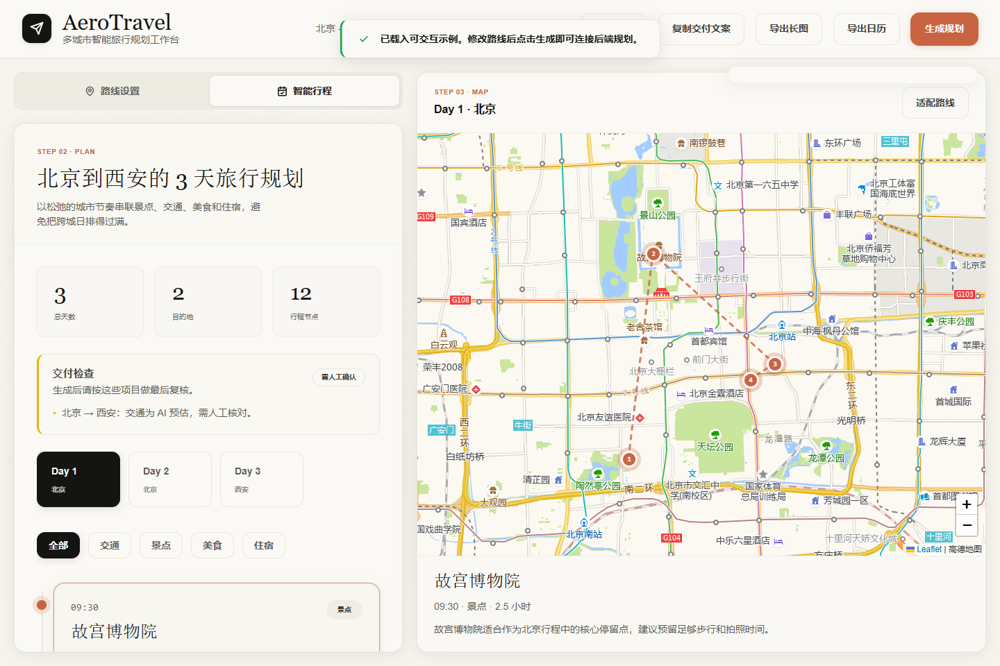
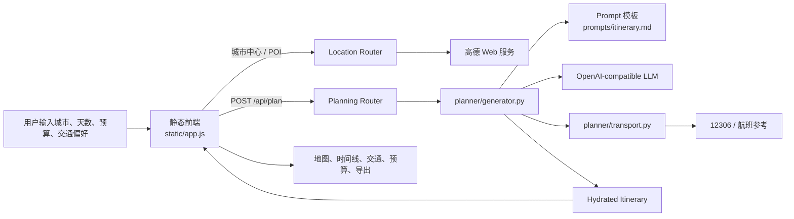
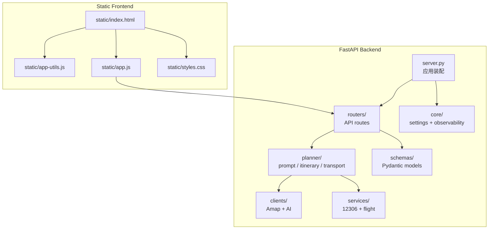

# AeroTravel AI 旅行规划师


面向中国多城市旅行的 AI 行程规划工作台。它不是只生成一段“看起来合理”的文本，而是把高德 POI、天气、12306 火车、航班参考数据和交互式地图串成一份能检查、能调整、能保存、能导出的行程。



## 为什么值得看

| 能力 | 说明 |
|---|---|
| 真实 POI | 后端代理高德 Web 服务，获取景点坐标、评分、地址、电话和开放时间。 |
| AI 行程编排 | 支持 OpenAI-compatible Chat Completions 接口，可接 OpenAI、通义千问、DeepSeek 等供应商。 |
| 交通可信度 | 跨城交通由服务端稳定生成 `A → B` 分段，再用 12306 / 航班参考数据增强。 |
| 天气感知 | 规划时查询城市天气，前端显示天气标签，并给雨雪天补充提醒。 |
| 交互地图 | Leaflet + 高德瓦片，按每日行程渲染点位和路线。 |
| 本地快照 | 最近行程保存在浏览器 `localStorage`，无数据库、无账号、低部署成本。 |
| 可交付 | 支持复制交付文案、导出长图、导出 `.ics` 日历。 |

## 整体流程



## 快速开始

### 1. 安装依赖

```powershell
pip install -r requirements.txt

# 可选：安装团队开发/CI 工具
pip install -r requirements-dev.txt
```

### 2. 配置环境变量

```powershell
Copy-Item .env.example .env
```

编辑 `.env`：

```dotenv
AMAP_KEY=你的高德 Web 服务 Key
AI_API_KEY=你的模型供应商 Key
AI_BASE_URL=https://api.openai.com/v1
AI_MODEL=gpt-5.5
```

### 3. 启动服务

```powershell
python server.py
```

打开 [http://localhost:8000](http://localhost:8000)。

## 模型配置建议

本项目走 OpenAI-compatible `chat/completions` 接口。不同供应商的模型和 endpoint 更新很快，下表按 2026-07-09 的官方文档整理，实际可用性以你的账号权限为准。

| 供应商 | `AI_BASE_URL` | 推荐 `AI_MODEL` | 适合场景 |
|---|---|---|---|
| OpenAI | `https://api.openai.com/v1` | `gpt-5.5` | 质量优先，复杂多城行程规划。 |
| OpenAI | `https://api.openai.com/v1` | `gpt-5.4-mini` | 成本和速度优先的日常规划。 |
| 阿里云百炼 / 通义千问 | `https://dashscope.aliyuncs.com/compatible-mode/v1` | `qwen3.7-plus` | 中文效果、成本、速度均衡。 |
| 阿里云百炼 / 通义千问 | `https://dashscope.aliyuncs.com/compatible-mode/v1` | `qwen3.7-max` | 更高质量中文规划。 |
| DeepSeek | `https://api.deepseek.com/v1` | `deepseek-v4-flash` | 成本优先，生成速度快。 |
| DeepSeek | `https://api.deepseek.com/v1` | `deepseek-v4-pro` | 推理质量优先。 |

参考文档：

- [OpenAI 最新模型迁移指南](https://developers.openai.com/api/docs/guides/latest-model)
- [阿里云百炼模型列表](https://www.alibabacloud.com/help/en/model-studio/models)
- [DeepSeek API 价格与模型说明](https://api-docs.deepseek.com/quick_start/pricing)

注意：DeepSeek 官方已标注 `deepseek-chat` 与 `deepseek-reasoner` 将在 2026-07-24 弃用，旧配置应尽快替换为 `deepseek-v4-flash` 或 `deepseek-v4-pro`。

## 常用命令

```powershell
# 开发启动
python server.py

# 热重载启动
python -m uvicorn server:app --reload --host 0.0.0.0 --port 8000

# 本地质量门禁
.\scripts\check.ps1

# 安全门禁
.\scripts\security.ps1

# API 冒烟
curl http://localhost:8000/api/health
curl "http://localhost:8000/api/city_center?city=北京"
curl "http://localhost:8000/api/search_pois?city=北京&keywords=景点&count=5"
curl "http://localhost:8000/api/weather?city=北京"
```

`.\scripts\check.ps1` 会运行 Python 语法检查、Ruff、Mypy、coverage-backed 后端回归测试，并检查所有 `static/*.js` 语法。`.\scripts\security.ps1` 会扫描跟踪文件中的疑似密钥并审计 Python 依赖漏洞。

## 架构结构



## 目录说明

```text
ai-travel-planner/
├── server.py              # FastAPI 应用装配入口
├── clients/               # 高德、AI 等外部服务客户端
├── core/                  # 配置、安全默认值、结构化日志
├── planner/               # 行程生成、prompt、hydration、交通增强逻辑
├── prompts/               # 可审查的 AI prompt 模板
├── routers/               # FastAPI API 路由
├── schemas/               # Pydantic 请求模型
├── services/              # 12306、航班等交通服务
│   ├── train_parser.py    # 12306 结果解析
│   └── train_station_cache.py # 车站缓存读写与反查表
├── static/
│   ├── index.html         # 单页应用壳
│   ├── app-utils.js       # 无构建前端纯工具函数
│   ├── state.js           # 初始状态和本地 fallback 常量
│   ├── api.js             # fetchJson 与 /api 路由兼容
│   ├── map.js             # Leaflet 地图初始化
│   ├── storage.js         # localStorage 快照读写
│   ├── export-ics.js      # ICS 和下载工具
│   ├── render.js          # 共享渲染辅助
│   ├── app.js             # 前端启动、事件绑定、状态编排
│   └── styles.css         # 前端样式
├── tests/                 # 按 clients/core/planner/routers/services 镜像组织的离线回归测试
├── docs/                  # 部署、回滚、冒烟检查、ADR
│   └── engineering/       # 协作、变更管理和发布流程
├── scripts/check.ps1      # 本地质量门禁
├── tasks/                 # 产品化规格和 backlog
└── tests/                 # 离线回归测试
```

## 生产配置要点

| 变量 | 默认值 | 说明 |
|---|---|---|
| `APP_ENV` | `development` | 生产设置为 `production`，会启用 HSTS 并禁止 `ALLOWED_ORIGINS=*`。 |
| `ALLOWED_ORIGINS` | 本机开发地址 | 逗号分隔的浏览器来源白名单，生产必须配置真实域名。 |
| `EXPOSE_CLIENT_CONFIG` | `false` | 当前前端不需要浏览器端高德 key，生产保持关闭。 |
| `LOG_LEVEL` | `INFO` | 后端结构化请求日志等级。 |
| `JUHE_FLIGHT_API_KEY` | 空 | 可选；不配置时使用内置航线参考数据。 |

生产环境不要提交 `.env`，不要使用 wildcard CORS，不要开启 `EXPOSE_CLIENT_CONFIG`，除非明确需要兼容旧版前端。

## 上线材料

- 部署与回滚清单：[docs/deployment-checklist.md](docs/deployment-checklist.md)
- 人工冒烟清单：[docs/smoke-checklist.md](docs/smoke-checklist.md)
- 工程变更管理：[docs/engineering/change-management.md](docs/engineering/change-management.md)
- 发布流程：[docs/engineering/release-process.md](docs/engineering/release-process.md)
- 持久化/auth 决策：[docs/decisions/ADR-001-local-only-persistence.md](docs/decisions/ADR-001-local-only-persistence.md)
- 产品化 backlog：[tasks/todo.md](tasks/todo.md)
- 实施记录：[IMPLEMENTATION.md](IMPLEMENTATION.md)

## 技术栈

| 层 | 技术 |
|---|---|
| 后端 | Python 3.10+, FastAPI, httpx, python-dotenv |
| 前端 | HTML, CSS, vanilla JavaScript |
| 地图 | Leaflet.js + 高德地图瓦片 |
| POI / 天气 | 高德 Web 服务 API |
| AI | OpenAI-compatible Chat Completions |
| 交通 | 12306 公开接口，聚合数据航班 API 可选 |
| 持久化 | 浏览器 localStorage |
| 工程治理 | Ruff, Mypy, Coverage, detect-secrets, pip-audit, pre-commit, GitHub Actions |

## License

MIT
