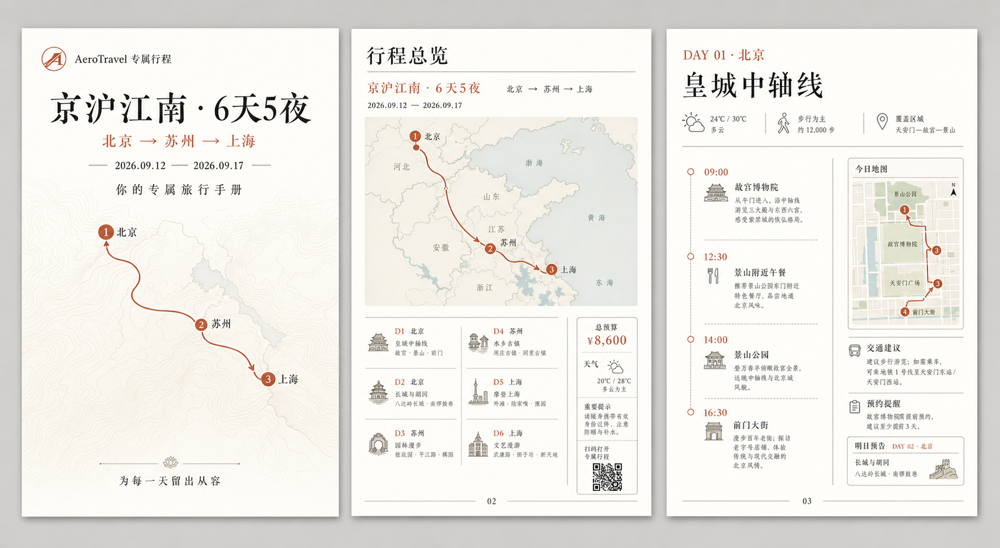
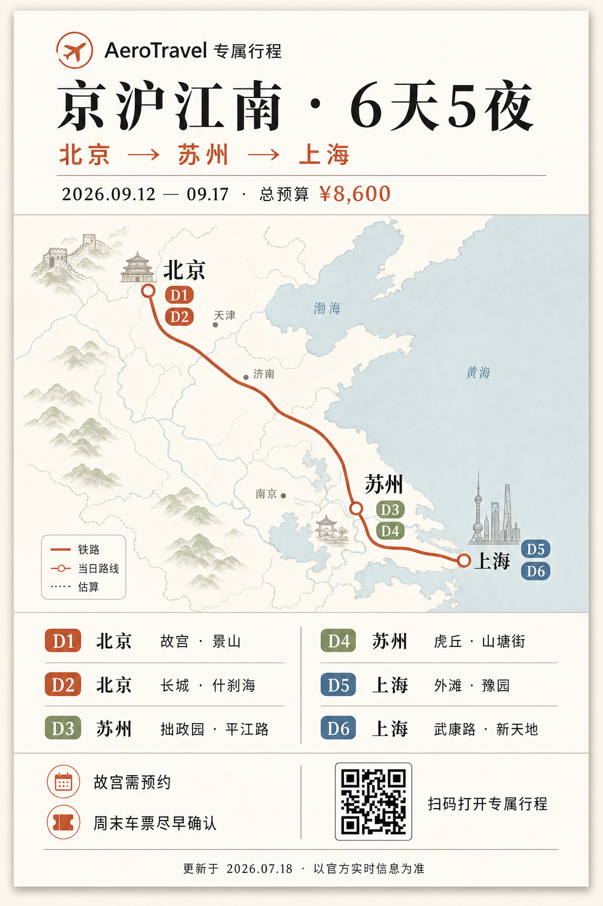
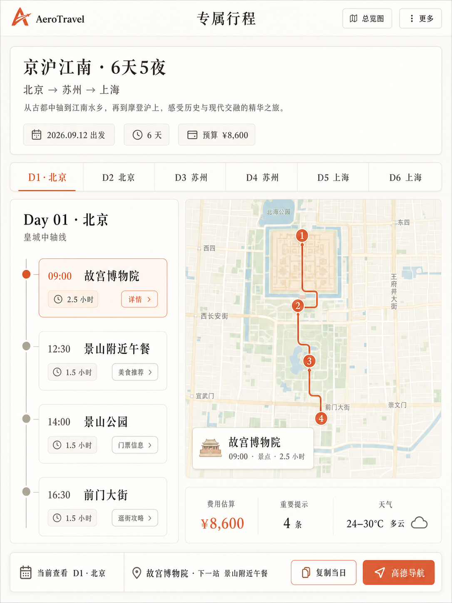
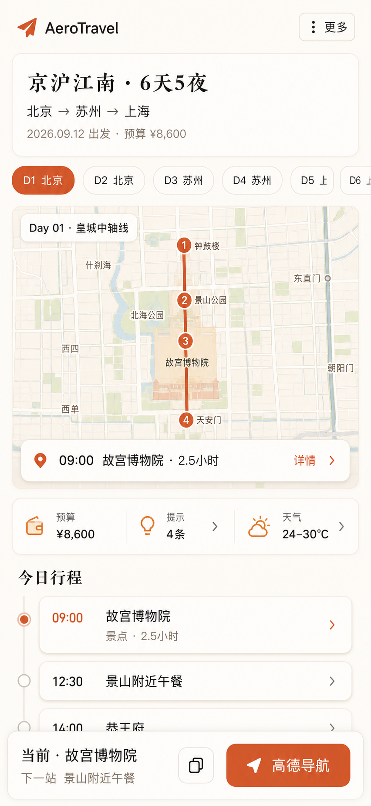

# AeroTravel 交付物布局效果图评审

- 日期：2026-07-18
- 状态：已确认并实施
- 范围：PDF 备份、PNG 总览图、专属行程页平板端与手机端
- 生成方式：Codex 内置 ImageGen（`ui-mockup`）

## 共同视觉方向

- 暖象牙白纸面、炭黑正文、陶土红强调，地图只使用少量低饱和蓝绿。
- 中文衬线体承担行程标题，中文无衬线体承担界面与正文。
- 地图、路线和时间线优先，不使用照片、紫色渐变或装饰性大阴影。
- 效果图只用于确认布局；正式实现继续使用真实 trip package、静态地图和可选择文本，不把生成图直接当作地图或 PDF 页面。

## 1. PDF 备份

推荐统一使用 A4 竖版，降低浏览器打印混合横竖页面时的分页风险：

1. 第 1 页为正式封面：品牌、标题、路线、日期、路线线稿和一句交付文案。
2. 第 2 页为行程总览：大地图、六天摘要、预算、天气、提示和二维码。
3. 第 3 页起为每日页：左侧时间线，右侧当日地图、交通与预约提醒。
4. 页码和分隔线使用稳定的打印安全区；不再在文档根节点额外输出一张隐藏地图，避免空白首页。

## 2. PNG 总览图

采用竖向 3:4 单页，建议固定信息占比：

- 标题与元信息约 16%。
- 总体路线地图约 52%，保持绝对主视觉。
- 六天摘要约 24%，每一天只保留两个核心地点。
- 提示、二维码与更新时间约 8%。

总览图不承载完整攻略；最多六个日标记，地图图例只保留道路、当日路线和估算三类。

## 3. 平板端专属行程页

- 目标视口：约 1024 × 1366 竖屏。
- 页头压缩为品牌、页面名、总览图和更多操作。
- 日期导航保持横向触控标签。
- 主工作区按约 40% / 60% 并排展示时间线与地图，不出现横向溢出。
- 底部操作条显示当前地点、下一站、复制当日和高德导航，并为内容预留等高底部空间。

## 4. 手机端专属行程页

- 目标视口：约 390 × 844。
- 导出与复制全文收进“更多”，顶部不再横向堆放三个按钮。
- 内容顺序改为：紧凑行程头 → 日期条 → 当日地图 → 关键数据 → 今日时间线。
- 时间线行只显示时间、地点、类型和时长；详细操作进入地点详情。
- 底部只保留复制快捷入口和高德导航，并适配安全区。

## 待确认的三个决定

1. PDF 是否接受全册 A4 竖版；若坚持总览页横版，需要单独验证混合纸张方向的浏览器兼容性。
2. PNG 总览图是否接受“地图约占 52% + 每日摘要只保留两个核心地点”的信息取舍。
3. 手机端是否接受“地图优先于时间线”的内容顺序。

## 实施结果

- 已修改 `static/js/delivery/trip-share-render.js`、`static/js/delivery/trip-share-boot.js` 与 `static/css/trip-share.css`。
- PDF 使用全册 A4 竖版；每日页以可打印的路线清单替代效果图中的装饰性小地图，避免伪造不存在的逐日静态底图。
- PNG 使用 540×720 逻辑画布，2× 导出 1080×1440。
- 平板和手机布局已在外置 Chrome 的 1024×1366、390×844 视口完成运行时验收。
- 对应前端测试、交付操作说明、smoke checklist 与 inbox 完成记录已同步。

完整 ImageGen 提示词见 [prompts.md](../assets/imagegen-2026-07-18/prompts.md)。
