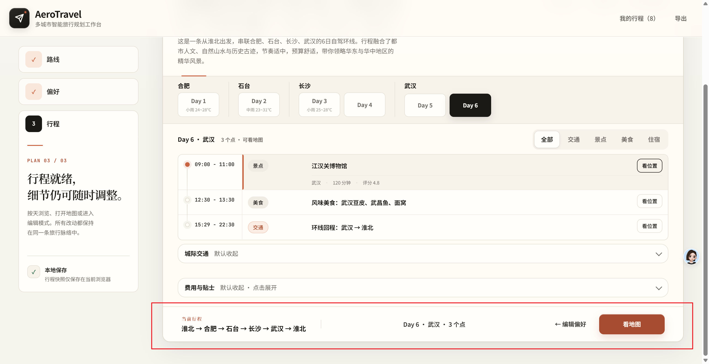

# AeroTravel 想法与问题收件箱

> 用途：随手记录尚未评审的想法、修改建议和小 Bug。
> 原则：先记下来，再定期整理；出现在这里不代表已经排期。
> 正式产品优先级以 [`docs/product/需求池.md`](../../docs/product/需求池.md) 为准。

## 快速记录

直接在本节顶部追加一条即可，不必为了填完整模板而放弃记录。

格式：

```text
- [ ] YYYY-MM-DD [类型] 一句话标题 — 场景或现象；期望（可选）；截图/日志/链接（可选）
```

类型只用以下三个，避免分类过细：

- `[Bug]`：实际行为与合理预期不一致。
- `[改进]`：已有能力可以做得更顺手、更清晰或更稳定。
- `[想法]`：新的用户价值、功能或商业假设。

<!-- 新记录写在这条注释下面，最新的放最上面。 -->

- [x] 2026-07-18 `P2` [Bug] README 质量门禁命令缺少路径分隔符 — 文档重写后示例显示为 `.scriptscheck.ps1` / `.scriptssecurity.ps1`，复制执行会失败；恢复为标准 PowerShell 相对路径。
- [x] 2026-07-18 `P2` [Bug] 1024px 平板底部摘要栏异常膨胀 — Step 2 元信息被压入约 26px 的窄列并逐字换行，使操作栏高达 275px；改用平板紧凑两行摘要，实测降至 76px。
- [x] 2026-07-18 `P2` [改进] 手机端行程标题选择控件命中区过小 — 短标题视觉高度仅 24px，低于触控容错标准；保持排版不变并将实际命中高度补足至至少 44px。
- [x] 2026-07-18 `P2` [改进] 前端源码按职责分层并清理本地产物 — `static/` 当前平铺 20 余个脚本和样式，入口、规划、地图、交付边界不易辨认；按 `css / js/core / js/planning / js/delivery` 整理，删除被忽略的 artifact 与测试临时目录，并同步所有引用和仓库导览。
- [x] 2026-07-18 `P2` [Bug] FastAPI 启动产生弃用警告 — `python server.py` 每次启动都提示 `on_event is deprecated`；改用 lifespan 初始化车站数据，保证启动日志干净且行为不变。
- [x] 2026-07-18 `P2` [改进] 行程列表的时间与触控信息过小 — 手机端“Day N · 城市 · 可看地图”按钮仅约 18px 高，部分时间文字为 10px；桌面路线排序按钮和“看位置”也只有 30–32px，细节难读且触控容错不足。期望手机端交互目标不低于 44px、关键辅助文字不低于 11–12px。
- [x] 2026-07-18 `P2` [Bug] 桌面行程结果层存在内部横向溢出 — 1521px 桌面视口下 `#resultsStack` / `#resultsBrowseLayer` 的 `scrollWidth` 比 `clientWidth` 多 32px，日期栏负外边距造成内容和焦点轮廓可能被裁切；期望结果层无非地图类横向溢出。
- [x] 2026-07-18 `P2` [改进] 手机端当前行程摘要文字过密 — 390px 视口下路线、行程形态、天数、日期、预算、节奏和交通挤在同一行组内，连续换行且扫读困难；改为清晰的路线主行、精简元信息和独立编辑操作。
- [x] 2026-07-18 `P1` [Bug] 行程卡片形成嵌套交互控件 — 行程卡片使用 `role=button`，内部又包含“看位置”按钮，辅助技术会读成按钮内嵌按钮；拆为同级“选择行程项”和“看位置”操作，保留键盘可达性与点击聚焦。
- [x] 2026-07-18 `P1` [Bug] 中文时段未参与时间排序 — Day 1 的“上午 城际转场”被排在“20:00 住宿”之后，主工作台与专属行程页都可复现；扩展时间解析并在应用、恢复与交付打包前统一稳定排序。
- [x] 2026-07-18 `P1` [Bug] 高德不可用时城市中心回退到错误位置 — `/api/city_center?city=西安` 在供应商不可用时返回固定 `116,30`，导致陕西历史博物馆导航到外省；使用城市级 GCJ-02 回退中心并覆盖行政后缀。
- [x] 2026-07-18 `P2` [改进] step1、2、3 行程页底部操作区常驻 — 将截图圈出的底部操作区（当前行程摘要、编辑偏好、看地图）在行程页滚动浏览时保持常驻，方便随时查看和操作；桌面、平板、手机均需避免遮挡正文并适配安全区。

  参考图：

- [x] 2026-07-18 [改进] 优化 PDF 备份导出布局并增加封面 — 当前导出的 PDF 备份第一页为空白，整体版式也需要优化；将第一页改为正式封面，并优化后续页面布局。实施前先使用 ImageGen 生成 PDF 封面和整体版式效果图，确认方案后再开发。

- [x] 2026-07-18 [改进] 优化总览图布局 — 当前总览图的布局需要优化；实施前先使用 ImageGen 生成布局效果图，确认方案后再开发。

- [x] 2026-07-18 [改进] 专属行程页适配平板端和手机端 — 优化专属行程页在平板与手机屏幕上的布局和使用体验；实施前先使用 ImageGen 分别生成平板端、手机端布局效果图，确认方案后再开发。

## 2026-07-18 测试工程审计

- 环境：Windows、外置 Chrome；桌面 `1521×791` / `1440×900`，手机 `390×844`；本地 FastAPI。
- 自动化基线：110 个 Python 测试、260 个前端测试、Ruff、Mypy、JS 语法全部通过。
- 运行时主流程：Step 1 → Step 2 → 生成 → Step 3、Day 切换、地图打开/关闭、专属页预览均可用；控制台无 error/warning。
- 说明：上述新记录来自实际 DOM、计算样式、导航链接和启动日志检查，属于现有单元测试未覆盖的排序、坐标、语义与视觉细节问题。
- 收尾复验：补充发现并修复平板摘要栏 275px 异常膨胀和手机标题 24px 触控区；最终 112 个 Python 测试、264 个前端测试及安全门禁全绿。


## 截图与素材归档

截图统一放在 [`figure/`](figure/)，用于保存想法、Bug 和布局讨论所需的视觉上下文。

命名格式：

`YYYYMMDD_<topic>_<viewport>_<purpose>_vNN.<ext>`

- `YYYYMMDD`：截图或记录日期，例如 `20260718`。
- `<topic>`：小写英文主题，单词之间使用短横线，例如 `itinerary-sticky-action-bar`。
- `<viewport>`：适用端或视口，例如 `desktop`、`tablet`、`mobile`、`responsive`。
- `<purpose>`：用途，例如 `reference`、`bug-before`、`bug-after`、`layout`、`flow`。
- `vNN`：版本号，从 `v01` 开始；同一视觉方案有变化时递增。

示例：`20260718_itinerary-sticky-action-bar_desktop_reference_v01.png`

不要使用 `image1.png`、`截图.png`、`最终版.png` 等无法检索或无法判断版本的名称。

## 需要补充详情时

只有准备分析或实施时才展开，不要求首次记录就写全。

```markdown
### YYYY-MM-DD｜[Bug/改进/想法] 标题

- 场景：谁在什么情况下遇到？
- 现象：现在发生了什么？
- 期望：希望变成什么样？
- 影响：阻塞使用 / 明显困扰 / 轻微不便 / 机会想法
- 证据：复现步骤、截图、报错、用户反馈或相关链接
- 建议：可选；先写问题，不必急着确定方案
```

Bug 建议至少补充以下信息：

```markdown
- 复现步骤：
  1.
  2.
  3.
- 实际结果：
- 预期结果：
- 环境：页面、浏览器、服务版本或 commit（知道多少写多少）
```

## 每周分诊

建议每周固定整理一次，每条记录只做一个决定：

1. 可立即修复且范围明确的 Bug：创建 GitHub Issue，使用现有 Bug 模板。
2. 值得验证的产品想法：补齐用户问题、证据和触发条件，移入 [`docs/product/需求池.md`](../../docs/product/需求池.md) 的 `Candidate`。
3. 已决定实施的改进：创建 GitHub Issue，写清验收标准和优先级。
4. 重复、无效或当前不做：移到下方“已处理记录”，简述原因，不直接删除。
5. 已完成的修改必须回填记录：勾选原条目，并在下方“已处理记录”中写明修复时间、Token 用量、修改结果和对应文件、Issue 或 commit。

优先级只在分诊时添加：

- `P0`：核心流程不可用、数据或安全风险，需要立即处理。
- `P1`：主要流程明显受阻，应优先处理。
- `P2`：有替代路径的一般问题或改进。
- `P3`：轻微体验问题或低证据想法。

## 已处理记录

| 记录日期 | 原记录 | 修复时间 | Token 用量 | 处理结果 | 去向或原因 |
|---|---|---|---|---|---|
| 2026-07-18 | README 质量门禁命令缺少路径分隔符 | 2026-07-18 | 非预算目标，运行时未提供精确统计 | 已完成：命令恢复为 `.\scripts\check.ps1` 和 `.\scripts\security.ps1`，本地链接复核无缺失 | [`README.md`](../../README.md)；本轮提交 |
| 2026-07-18 | 1024px 平板底部摘要栏异常膨胀 | 2026-07-18 | 非预算目标，运行时未提供精确统计 | 已完成：901–1260px 使用紧凑两行摘要，Step 2 操作栏由 275px 降至 76px，元信息单行省略且主操作保持可见 | [`workspace.css`](../../static/css/workspace.css)、[`shell.test.js`](../../tests/frontend/shell.test.js)；本轮提交 |
| 2026-07-18 | 手机端行程标题选择控件命中区过小 | 2026-07-18 | 非预算目标，运行时未提供精确统计 | 已完成：桌面最小 36px、手机最小 44px；390×844 实测所有可见标题选择控件均达到 44px | [`workspace.css`](../../static/css/workspace.css)、[`shell.test.js`](../../tests/frontend/shell.test.js)；本轮提交 |
| 2026-07-18 | 前端源码按职责分层并清理本地产物 | 2026-07-18 | 非预算目标，运行时未提供精确统计 | 已完成：样式与脚本按 `css / js/core / js/planning / js/delivery` 归档，HTML、测试、发布打包和递归语法检查同步更新，并补仓库导航 | [`static/README.md`](../../static/README.md)、[`repository-map.md`](../../docs/engineering/repository-map.md)、[`check.ps1`](../../scripts/check.ps1)；本轮提交 |
| 2026-07-18 | FastAPI 启动产生弃用警告 | 2026-07-18 | 非预算目标，运行时未提供精确统计 | 已完成：启动初始化迁移到 lifespan，车站数据仍只初始化一次，实际启动无 `on_event` 弃用警告 | [`server.py`](../../server.py)、[`test_runtime_hardening.py`](../../tests/core/test_runtime_hardening.py)；本轮提交 |
| 2026-07-18 | 行程列表的时间与触控信息过小 | 2026-07-18 | 非预算目标，运行时未提供精确统计 | 已完成：日期提示、地图动作、排序控件和时间辅助文字提升至可读尺寸；手机关键交互目标统一为 44px | [`workspace.css`](../../static/css/workspace.css)、[`shell.test.js`](../../tests/frontend/shell.test.js)；本轮提交 |
| 2026-07-18 | 桌面行程结果层存在内部横向溢出 | 2026-07-18 | 非预算目标，运行时未提供精确统计 | 已完成：收紧结果层宽度与日期栏边距；桌面、平板、手机实测 `scrollWidth` 不再大于 `clientWidth` | [`workspace.css`](../../static/css/workspace.css)；本轮提交 |
| 2026-07-18 | 手机端当前行程摘要文字过密 | 2026-07-18 | 非预算目标，运行时未提供精确统计 | 已完成：摘要拆为路线主行、最多两行元信息和独立双列编辑操作，390px 下无横向溢出 | [`workspace.css`](../../static/css/workspace.css)；本轮提交 |
| 2026-07-18 | 行程卡片形成嵌套交互控件 | 2026-07-18 | 非预算目标，运行时未提供精确统计 | 已完成：卡片容器恢复语义中立，标题选择与“看位置”为同级原生按钮；运行时 `button button` 数量为 0 | [`app.js`](../../static/js/app.js)、[`shell.test.js`](../../tests/frontend/shell.test.js)；本轮提交 |
| 2026-07-18 | 中文时段未参与时间排序 | 2026-07-18 | 非预算目标，运行时未提供精确统计 | 已完成：统一宽泛时段与明确钟点排序；宽泛时段不参与精确重叠判定，实测顺序为“上午 → 09:30 → 12:30 → 14:00 → 20:00”且误冲突为 0 | [`scheduling.py`](../../planner/scheduling.py)、[`app-utils.js`](../../static/js/core/app-utils.js)、[`test_scheduling.py`](../../tests/planner/test_scheduling.py)；本轮提交 |
| 2026-07-18 | 高德不可用时城市中心回退到错误位置 | 2026-07-18 | 非预算目标，运行时未提供精确统计 | 已完成：加入城市级 GCJ-02 中心与行政后缀归一化；西安回退为 `108.944456,34.340044`，专属页高德链接均落在西安附近 | [`amap.py`](../../clients/amap.py)、[`state.js`](../../static/js/core/state.js)、[`test_amap_client.py`](../../tests/clients/test_amap_client.py)；本轮提交 |
| 2026-07-18 | Step 1、2、3 行程页底部操作区常驻 | 2026-07-18 | 非预算目标，运行时未提供精确统计 | 已完成：三步操作栏按视口 sticky 常驻并避让安全区；手机 Step 2/3 高约 93px、平板与桌面高 76px，不遮挡正文 | [`workspace.css`](../../static/css/workspace.css)、[`shell.test.js`](../../tests/frontend/shell.test.js)；本轮提交 |
| 2026-07-18 | 优化 PDF 备份导出布局并增加封面 | 2026-07-18 | 非预算目标，运行时未提供精确统计 | 已完成：正式封面、总览页、每日双栏页与费用/交通/提示末页；移除导致空白首页的首部冗余地图节点 | [`trip-share-render.js`](../../static/js/delivery/trip-share-render.js)、[`trip-share.css`](../../static/css/trip-share.css)、[效果图与评审](../../docs/product/2026-07-18-delivery-layout-mockups.md)；待 commit |
| 2026-07-18 | 优化总览图布局 | 2026-07-18 | 非预算目标，运行时未提供精确统计 | 已完成：固定 3:4 画布，地图优先、双列每日摘要、预算/提示/二维码分区，2× 导出 1080×1440 | [`trip-share-render.js`](../../static/js/delivery/trip-share-render.js)、[`trip-share.css`](../../static/css/trip-share.css)、[效果图](../../docs/assets/imagegen-2026-07-18/overview-export-layout-concept.png)；待 commit |
| 2026-07-18 | 专属行程页适配平板端和手机端 | 2026-07-18 | 非预算目标，运行时未提供精确统计 | 已完成：平板 40/60 双栏；手机地图优先单列、更多菜单、三项关键数据与安全区底栏；外置 Chrome 验收无横向溢出和控制台错误 | [`trip-share-render.js`](../../static/js/delivery/trip-share-render.js)、[`trip-share-boot.js`](../../static/js/delivery/trip-share-boot.js)、[`trip-share.css`](../../static/css/trip-share.css)、[`smoke-checklist.md`](../../docs/smoke-checklist.md)；待 commit |
|  |  |  |  | 已建 Issue / 已进需求池 / 暂不处理 / 重复 |  |
